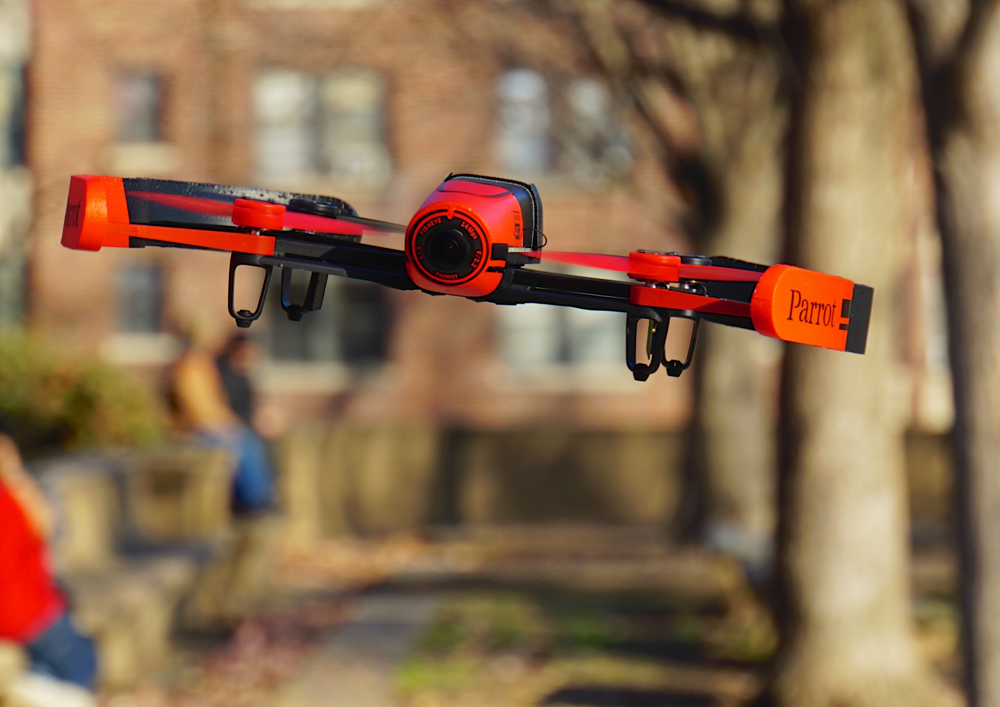

# Onboard Obstacle Avoidance and CNN Gate Detection for Parrot Bebop

This repository contains the implementation developed by **Group 9** for the **TU Delft Autonomous Flight of MAV course (AE4317 / MAVLab 2026)**.

The project extends **Paparazzi UAS** for autonomous indoor flight with a physical **Parrot Bebop drone**. The goal was to run perception and navigation onboard under strong hardware constraints, using lightweight computer vision methods suitable for real-time flight.

The main project contribution is available on the `compressed_detector` branch, which contains the fast and efficient onboard obstacle avoidance solution used by the team. My separate `cnn_gate_detector` branch contains my work on CNN-based gate detection and initial gate-following behavior.

**Pull request:** [tudelft/paparazzi#119](https://github.com/tudelft/paparazzi/pull/119)

---

## Demo




---
## Results

The full team system achieved:

- Competition ranking: 4th out of 14 teams
- Distance traveled: 69 m
- Successful gate traversals: 4 (Best team)

---

## Project overview

The project implements a custom vision-based obstacle avoidance system for a rotorcraft in Paparazzi. The full pipeline is split into two main modules:

- `custom_detector`: processes the camera stream onboard and extracts obstacle evidence from orange and green regions in the environment
- `custom_avoider`: receives the detector output and converts it into reactive navigation commands through a state-machine-based avoidance strategy

The detector reduces the camera image to a compact **left / middle / right** obstacle representation, which is then used by the avoider to decide whether to move forward, slightly adjust heading, or search for a safer direction. The implementation was inspired by the logic of Paparazzi’s `orange_avoider` module, but was adapted to work with the custom perception pipeline developed for this project.

The implementation follows the standard Paparazzi project structure:

- the `custom_detector` module belongs to the computer vision layer and its source files are placed in `/sw/airborne/modules/computer_vision/`
- the `custom_avoider` module belongs to the navigation layer and its source files are placed in `/sw/airborne/modules/custom_avoider/`
- the corresponding module definition files, `custom_detector.xml` and `custom_avoider.xml`, are located in `/conf/modules/`
- the airframe configuration used to run the project is `custom_airframe.xml`, which, following the Paparazzi crash course conventions, is located in `/conf/airframes/tudelft/`

---

## My Contribution (Tommaso Calzolari): CNN Gate Detection

The main team branch for this project is `compressed_detector`, which contains the fast and efficient onboard obstacle-avoidance solution. My separate branch, `cnn_gate_detector`, contains my work on CNN-based gate detection and initial gate-following behavior.

I developed a compact gate detector for the Parrot Bebop that runs onboard without external machine-learning libraries. The CNN was implemented manually in C, has approximately **16k trainable parameters**, and predicts gate presence together with the gate bounding box:

- `presence_score`: whether the gate is visible
- `cx`, `cy`: normalized gate-center coordinates
- `w`, `h`: normalized bounding-box dimensions

For the dataset, I first manually labeled a smaller set of gate images and then used **YOLO11 Nano** to generate labels for a larger dataset of approximately **15k images**.

The final CNN achieved:

- **Gate presence accuracy:** 96.09%
- **Onboard inference time:** ~5 ms per image
- **Approximate throughput:** ~200 Hz

During real-world testing, the detector was able to recognize the gate, guide the drone toward it, and support a pass-through maneuver.
---

## Contributors

**Group:** 9  
**Submission date:** 31/03/2026

| Name              | NetID       | Student Number |
|-------------------|-------------|----------------|
| M. Sanz Piña      | msanzpina   | 6557368        |
| Tommaso Calzolari | tcalzolari  | 6430600        |
| Leonardo Pedretti | lpedretti   | 6432891        |
| D. Townsend       | dtownsed    | 6315577        |
| E. Bester         | ebester     | 6534899        |
| H. Kovács         | hkovacs     | 6549608        |

---
## Full Report

A detailed technical explanation of the complete project is available here:

[Project report](docs/project_report.pdf)
---

To run our solution, first install Paparazzi following the standard Paparazzi Readme:

# MAIN README

Paparazzi UAS
=============
[](https://paparazziuav.semaphoreci.com/projects/paparazzi) [](https://gitter.im/paparazzi/discuss)
<a href="https://scan.coverity.com/projects/paparazzi-paparazzi">
  
</a>

Paparazzi is a free open source software package for Unmanned (Air) Vehicle Systems.
For many years, the system has been used successfuly by hobbyists, universities and companies all over the world, on vehicles of various sizes (11.9g to 25kg).
Paparazzi supports fixed wing, rotorcraft, hybrids, flapping vehicles and it is even possible to use it for boats and surface vehicles.

Documentation is available here https://paparazzi-uav.readthedocs.io/en/latest/

More docs is also available on the wiki http://wiki.paparazziuav.org

To get in touch, subscribe to the mailing list [paparazzi-devel@nongnu.org] (http://savannah.nongnu.org/mail/?group=paparazzi), the IRC channel (freenode, #paparazzi) and Gitter (https://gitter.im/paparazzi/discuss).

Required software
-----------------

Instructions for installation can be found on the wiki (http://wiki.paparazziuav.org/wiki/Installation).

Quick start:

```
git clone https://github.com/paparazzi/paparazzi.git
cd ./paparazzi
./install.sh
```


For Ubuntu users, required packages are available in the [paparazzi-uav PPA] (https://launchpad.net/~paparazzi-uav/+archive/ppa),
Debian users can use the [OpenSUSE Build Service repository] (http://download.opensuse.org/repositories/home:/flixr:/paparazzi-uav/Debian_7.0/)

Debian/Ubuntu packages:
- **paparazzi-dev** is the meta-package on which the Paparazzi software depends to compile and run the ground segment and simulator.
- **paparazzi-jsbsim** is needed for using JSBSim as flight dynamics model for the simulator.

Recommended cross compiling toolchain: https://launchpad.net/gcc-arm-embedded


Directories quick and dirty description:
----------------------------------------

_conf_: the configuration directory (airframe, radio, ... descriptions).

_data_: where to put read-only data (e.g. maps, terrain elevation files, icons)

_doc_: documentation (diagrams, manual source files, ...)

_sw_: software (onboard, ground station, simulation, ...)

_var_: products of compilation, cache for the map tiles, ...


Compilation and launching custom implementation:
-------------------------------

1. type "make" in the top directory to compile all the libraries and tools.

2. "./paparazzi" to run the Paparazzi Center

3. Select in the dropdown bar at the top  "bebop_custom_avoid" 

4. Select in the airframe the `custom_airframe.xml` module inside `/conf/airframes/tudelft/`

5. Click "Clean" and "Build". Use nps if you want to run in simulation or ap if you want to deploy it on the real drone

6. In the Build file you can check the object file of our two custom modules named `custom_detector_compressed.o` and `custom_avoider.o`


7. When the compilation is finished, select "Simulation" in Operation tab and click "Start Session".

8. In the GCS, wait about 10s for the aircraft to be in the "Holding point" navigation block.
  Switch to the "Takeoff" block (lower-left blue airway button in the strip).
  Takeoff with the green launch button.

Uploading the embedded software
----------------------------------

1. Power the flight controller board while it is connected to the PC with the USB cable.

2. From the Paparazzi center, select the "ap" target, and click "Upload".


Flight
------

1.  From the Paparazzi Center, select the flight session and ... do the same as in simulation !
