# Onboard Obstacle Avoidance and CNN Gate Detection for Parrot Bebop

This repository contains the implementation developed by **Group 9** for the **TU Delft Autonomous Flight of MAV course (AE4317 / MAVLab 2026)**.

The project extends **Paparazzi UAS** for autonomous indoor flight with a physical **Parrot Bebop drone**. The goal was to run perception and navigation onboard under strong hardware constraints, using lightweight computer vision methods suitable for real-time flight.

The main team implementation is available on the `compressed_detector` branch. My separate `cnn_gate_detector` branch contains the CNN-based gate detection work and initial gate-following behavior.

**Pull request:** [tudelft/paparazzi#119](https://github.com/tudelft/paparazzi/pull/119)

**Full report:** [Project report](media/project_report.pdf)

---

## Demo 

<table>
  <tr>
    <td align="center" width="35%">
      
      <br>
      <em>Parrot Bebop drone</em>
    </td>
    <td align="center" width="65%">
      
      <br>
      <em>Onboard perception and navigation demo</em>
    </td>
  </tr>
</table>

[MP4 demo video](media/demo.mp4)

---

## Results

The full team system achieved:

- Competition ranking: 4th out of 14 teams
- Distance traveled: 69 m
- Successful gate traversals: 4 (Best team)

---

## System Overview

The project adds a custom onboard obstacle-avoidance stack to Paparazzi:

- `custom_detector`: processes the camera stream and extracts orange-pillar and green-plant obstacle evidence.
- `custom_avoider`: converts the detector output into left / middle / right risk sectors for reactive navigation.

The vision pipeline runs on downsampled YUV camera frames and uses color segmentation plus lightweight structural filters. The final output is a compact risk map that the navigation state machine uses to select safe motion directions.

### Orange Obstacle Detection

Orange pillars are detected with YUV thresholding, then filtered by vertical support and geometric consistency.

<table>
  <tr>
    <td align="center" width="33%">
      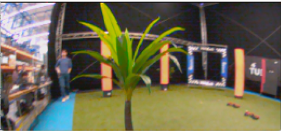
      <br>
      <sub>Original frame</sub>
    </td>
    <td align="center" width="33%">
      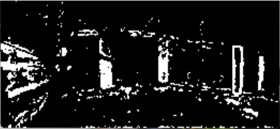
      <br>
      <sub>Raw orange mask</sub>
    </td>
    <td align="center" width="33%">
      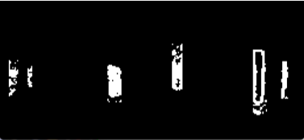
      <br>
      <sub>Validated obstacle mask</sub>
    </td>
  </tr>
</table>

### Green Plant Detection

Green plants are harder to separate from the background, so the raw green mask is supported by vertical edges before final validation. Two representative plant examples are shown below.

<table>
  <tr>
    <td align="center" width="20%">
      
      <br>
      <sub>Original</sub>
    </td>
    <td align="center" width="20%">
      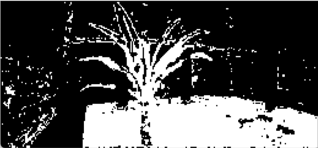
      <br>
      <sub>Raw green</sub>
    </td>
    <td align="center" width="20%">
      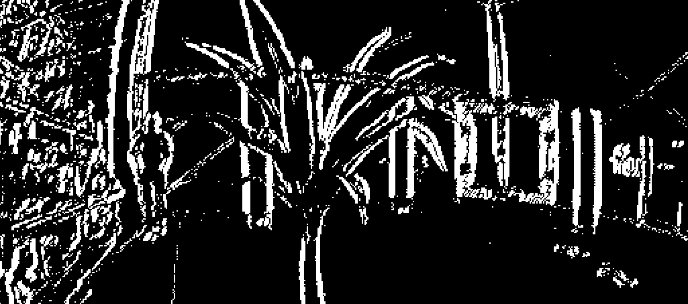
      <br>
      <sub>Vertical edges</sub>
    </td>
    <td align="center" width="20%">
      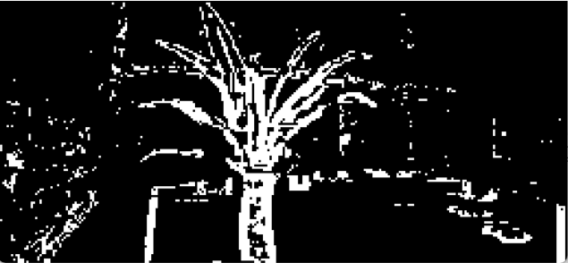
      <br>
      <sub>Edge-supported</sub>
    </td>
    <td align="center" width="20%">
      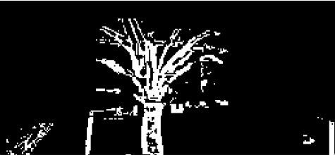
      <br>
      <sub>Validated</sub>
    </td>
  </tr>
  <tr>
    <td align="center" width="20%">
      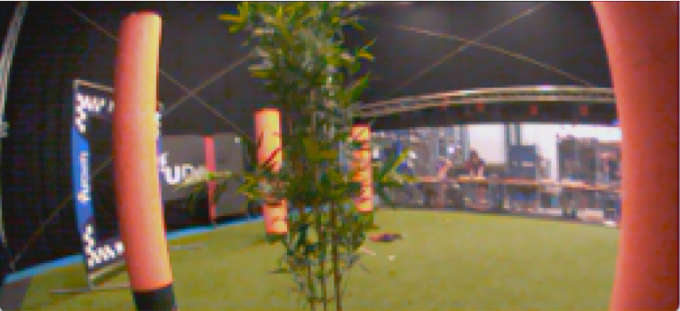
      <br>
      <sub>Original</sub>
    </td>
    <td align="center" width="20%">
      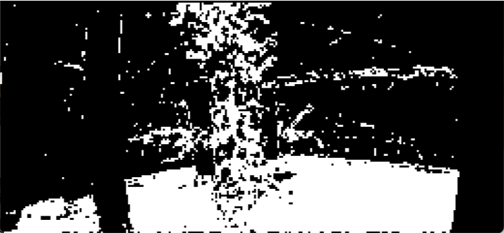
      <br>
      <sub>Raw green</sub>
    </td>
    <td align="center" width="20%">
      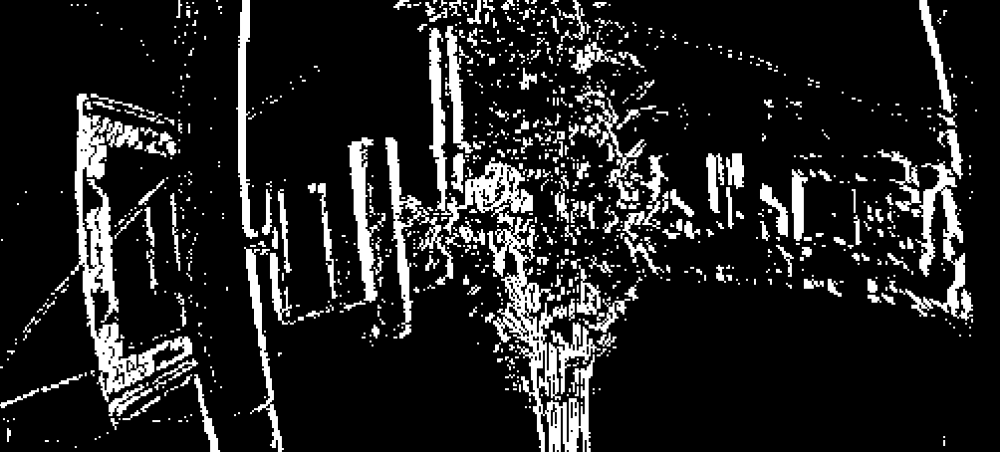
      <br>
      <sub>Vertical edges</sub>
    </td>
    <td align="center" width="20%">
      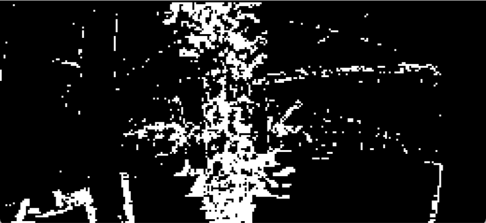
      <br>
      <sub>Edge-supported</sub>
    </td>
    <td align="center" width="20%">
      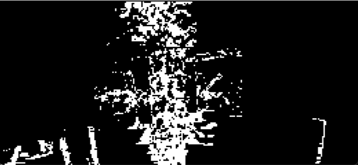
      <br>
      <sub>Validated</sub>
    </td>
  </tr>
</table>

### Combined Avoidance Output

The validated orange and green masks are merged into one obstacle representation and converted into a navigation risk map.

<table>
  <tr>
    <td align="center" width="33%">
      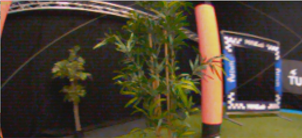
      <br>
      <sub>Original scene</sub>
    </td>
    <td align="center" width="33%">
      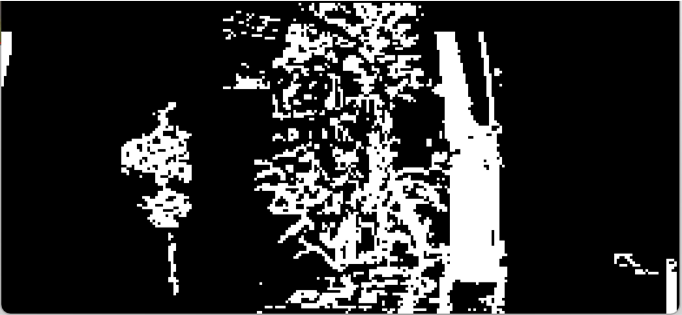
      <br>
      <sub>Combined obstacle mask</sub>
    </td>
    <td align="center" width="33%">
      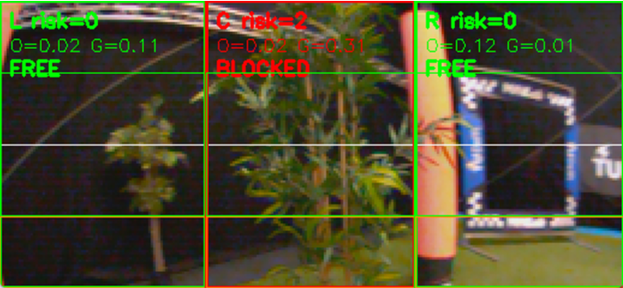
      <br>
      <sub>Risk map for navigation</sub>
    </td>
  </tr>
</table>

---

## My Contribution: CNN Gate Detection

I developed a compact gate detector for the Parrot Bebop that runs onboard without external machine-learning libraries. The network was implemented manually in C, has approximately **16k trainable parameters**, and predicts gate presence plus a bounding box:

- `presence_score`: whether the gate is visible.
- `cx`, `cy`: normalized gate-center coordinates.
- `w`, `h`: normalized bounding-box dimensions.

The dataset started with manual labels, then **YOLO11 Nano** was trained on those labels and used to automatically label roughly **15k images**. The final CNN detections compare predicted boxes and centers against ground truth on unseen test images.

<table>
  <tr>
    <td align="center" width="25%">
      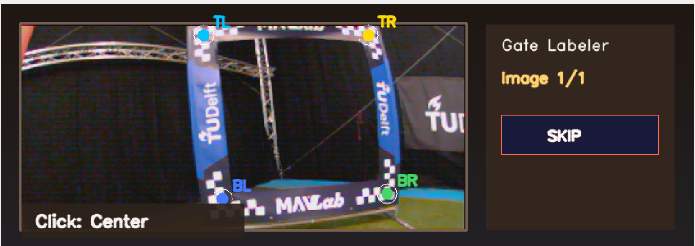
      <br>
      <sub>Manual gate label</sub>
    </td>
    <td align="center" width="25%">
      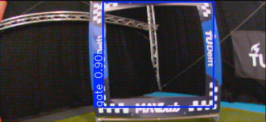
      <br>
      <sub>YOLO auto-label</sub>
    </td>
    <td align="center" width="25%">
      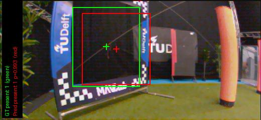
      <br>
      <sub>CNN result: 0.99 confidence</sub>
    </td>
    <td align="center" width="25%">
      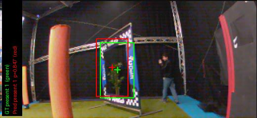
      <br>
      <sub>CNN result: skewed angle</sub>
    </td>
  </tr>
</table>

The final CNN achieved:

- **Gate presence accuracy:** 96.09%
- **Onboard inference time:** ~5 ms per image
- **Approximate throughput:** ~200 Hz

During real-world testing, the detector recognized the gate, guided the drone toward it, and supported a pass-through maneuver.

---

## Contributors

**Group:** 9  
**Submission date:** 31/03/2026

| Name              | NetID       | Student Number |
|-------------------|-------------|----------------|
| M. Sanz Piña      | msanzpina   | 6557368        |
| Tommaso Calzolari | tcalzolari  | 6430600        |
| Leonardo Pedretti | lpedretti   | 6432891        |
| D. Townsend       | dtownsed    | 6315577        |
| E. Bester         | ebester     | 6534899        |
| H. Kovács         | hkovacs     | 6549608        |

---

To run our solution, first install Paparazzi following the standard Paparazzi Readme:

# MAIN README

Paparazzi UAS
=============
[](https://paparazziuav.semaphoreci.com/projects/paparazzi) [](https://gitter.im/paparazzi/discuss)
<a href="https://scan.coverity.com/projects/paparazzi-paparazzi">
  
</a>

Paparazzi is a free open source software package for Unmanned (Air) Vehicle Systems.
For many years, the system has been used successfuly by hobbyists, universities and companies all over the world, on vehicles of various sizes (11.9g to 25kg).
Paparazzi supports fixed wing, rotorcraft, hybrids, flapping vehicles and it is even possible to use it for boats and surface vehicles.

Documentation is available here https://paparazzi-uav.readthedocs.io/en/latest/

More docs is also available on the wiki http://wiki.paparazziuav.org

To get in touch, subscribe to the mailing list [paparazzi-devel@nongnu.org] (http://savannah.nongnu.org/mail/?group=paparazzi), the IRC channel (freenode, #paparazzi) and Gitter (https://gitter.im/paparazzi/discuss).

Required software
-----------------

Instructions for installation can be found on the wiki (http://wiki.paparazziuav.org/wiki/Installation).

Quick start:

```
git clone https://github.com/paparazzi/paparazzi.git
cd ./paparazzi
./install.sh
```


For Ubuntu users, required packages are available in the [paparazzi-uav PPA] (https://launchpad.net/~paparazzi-uav/+archive/ppa),
Debian users can use the [OpenSUSE Build Service repository] (http://download.opensuse.org/repositories/home:/flixr:/paparazzi-uav/Debian_7.0/)

Debian/Ubuntu packages:
- **paparazzi-dev** is the meta-package on which the Paparazzi software depends to compile and run the ground segment and simulator.
- **paparazzi-jsbsim** is needed for using JSBSim as flight dynamics model for the simulator.

Recommended cross compiling toolchain: https://launchpad.net/gcc-arm-embedded


Directories quick and dirty description:
----------------------------------------

_conf_: the configuration directory (airframe, radio, ... descriptions).

_data_: where to put read-only data (e.g. maps, terrain elevation files, icons)

_doc_: documentation (diagrams, manual source files, ...)

_sw_: software (onboard, ground station, simulation, ...)

_var_: products of compilation, cache for the map tiles, ...


Compilation and launching custom implementation:
-------------------------------

1. type "make" in the top directory to compile all the libraries and tools.

2. "./paparazzi" to run the Paparazzi Center

3. Select in the dropdown bar at the top  "bebop_custom_avoid" 

4. Select in the airframe the `custom_airframe.xml` module inside `/conf/airframes/tudelft/`

5. Click "Clean" and "Build". Use nps if you want to run in simulation or ap if you want to deploy it on the real drone

6. In the Build file you can check the object file of our two custom modules named `custom_detector_compressed.o` and `custom_avoider.o`


7. When the compilation is finished, select "Simulation" in Operation tab and click "Start Session".

8. In the GCS, wait about 10s for the aircraft to be in the "Holding point" navigation block.
  Switch to the "Takeoff" block (lower-left blue airway button in the strip).
  Takeoff with the green launch button.

Uploading the embedded software
----------------------------------

1. Power the flight controller board while it is connected to the PC with the USB cable.

2. From the Paparazzi center, select the "ap" target, and click "Upload".


Flight
------

1.  From the Paparazzi Center, select the flight session and ... do the same as in simulation !
